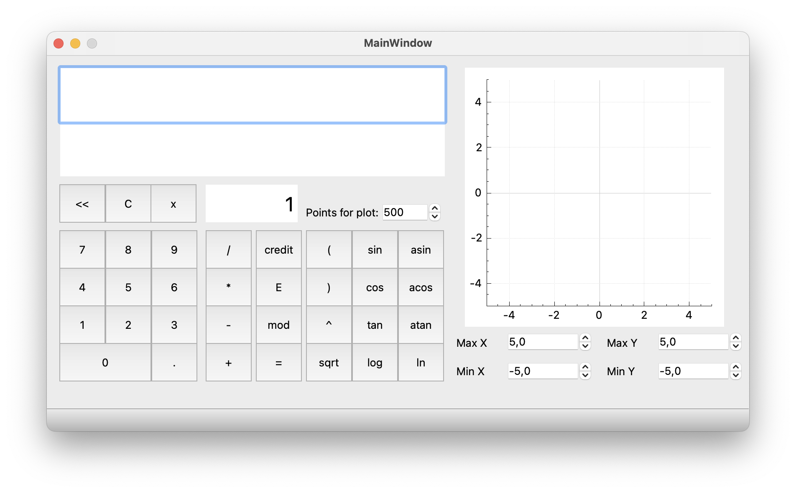
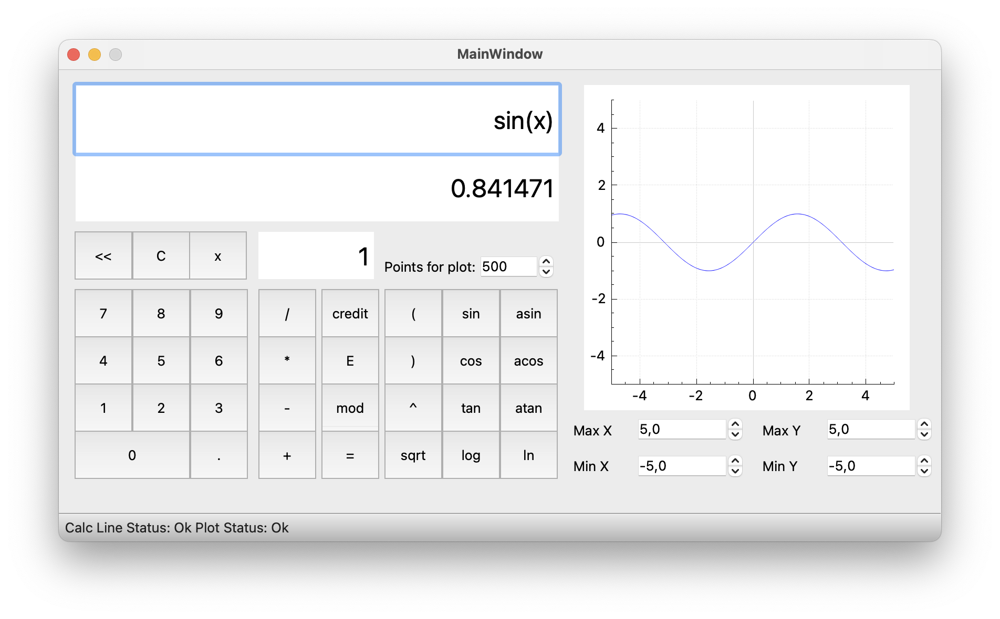
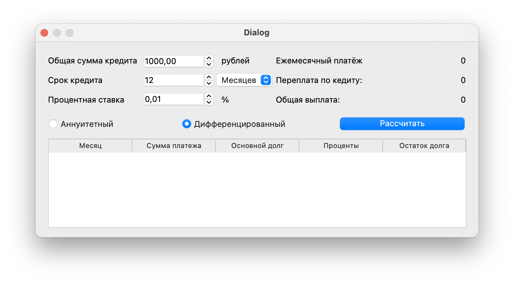
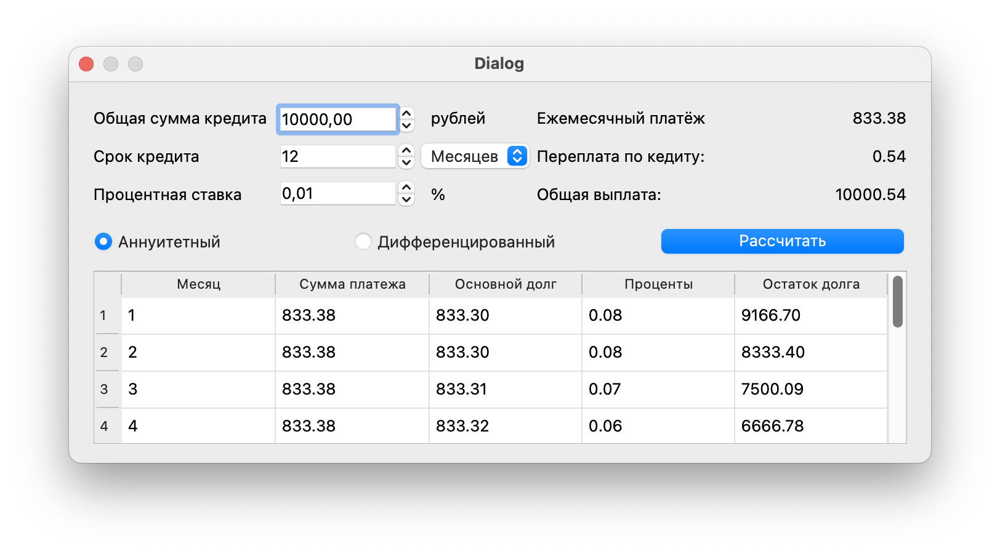

#  S21_Smart_Calc 

Данное приложение представляет собой расширенный калькулятор с возможностью построения графиков и дополнительным функционалом ввиде расчетов кредитных платежей.

### Калькулятор
- Калькулятор - может принемать значения с клавиатуры и с графического интерфейса. \
- Для вычисления выражения нужно нажать клавишу интерфейса "=" в приложении или NumEnter на клавиатуре. \
- Для полной очистки поля ввода нужно нажать кнопку "AC", для посимвольной - "<<" или на клавиатуре Delete и BackSpace соответсвенно. 

Поддерживаемые вычисления: 

* Сложение "+";
* Вычитание "-";
* Умножение "*";
* Деление "/";
* Возведение в степень "^";
* Остаток от деления "mod";
* Унарный минус "-a";
* Научная нотация "1e+02" "1e-02";
\
* cos(x);
* sin(x);
* tan(x);
* acos(x);
* asin(x);
* atan(x);
* sqrt(x);
* log(x);
* ln(x);

### Графики

Отрисовка графиков:
  -  Построение происходит после клавиши интерфейса "=" при этом происходит калькуляция выражения;
  -  Для корректного построения графика в строке ввода должен присутсивовать x;
  -  Масштаб полотна по умолчанию от -5 до 5 по обеим осям, для изменения масштаба введите числа в соответсвующую ячейку;

### Кредитный калькулятор

- Окно с расчетом кредитных платежей открывается после нажимания клавиши интерфейса "Кредит";
- Для рассчета нужно заполнить все поля для ввода;
- Срок расчета кредита может принимать количество лет и количество месяцев;
- Калькулятор может производить расчеты как аннуитетных так и дифференцированных платежей;

### About

Программа написана на языке C++ с использованием фреймворка Qt для разработки графического интерфейса программы.
